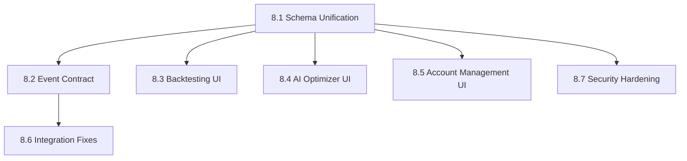

# Epic 8: Code Audit Remediation — Schema Unification & Integration Fixes

## Overview

This epic addresses remaining issues found during the comprehensive Epic 1-7 code audit. The audit identified 26 issues across 3 categories: schema conflicts between Go services, missing frontend pages, and integration/data-flow issues.

**Audit Branch:** `audit/epic-1-7-full-review`
**Audit Report Date:** 2026-07-08
**Total Issues Found:** 46 (20 fixed, 26 remaining)

---

## Issue Summary

| Severity | Fixed | Remaining | Total |
|----------|-------|-----------|-------|
| CRITICAL | 4 | 7 | 11 |
| HIGH | 2 | 10 | 12 |
| MEDIUM | 4 | 9 | 13 |
| LOW | 2 | 0 | 2 |
| **TOTAL** | **12** | **26** | **38** |

---

## Stories

### Story 8.1: Schema Unification — Move ensureSchema() to Migrations

**Priority:** CRITICAL
**Estimated Effort:** 3-5 days

**Problem:**
Multiple Go services create tables using `ensureSchema()` with conflicting schemas. Whichever service starts first "wins" the schema, causing runtime failures for other services.

**Affected Tables:**
| Table | Conflicting Definitions | Services |
|-------|------------------------|----------|
| `risk_events` | 3 different schemas | risk-manager, execution-engine |
| `positions` | 2 different schemas | risk-manager, position-manager |
| `opportunities` | 2 different schemas | migration 007, arb-engine |
| `trades` | INSERT uses non-existent columns | execution-engine |

**Acceptance Criteria:**
- [ ] All table definitions consolidated into migrations
- [ ] `ensureSchema()` calls removed from Go services
- [ ] All services use migration-managed tables
- [ ] Existing data preserved during migration
- [ ] All services start successfully regardless of startup order

**Tasks:**
1. Audit all `ensureSchema()` implementations
2. Create unified migration for each conflicting table
3. Write data migration scripts if needed
4. Remove `ensureSchema()` from Go services
5. Test all services with clean database
6. Test all services with existing data

---

### Story 8.2: Event Contract Alignment — Fix NATS Subject & Schema Mismatches

**Priority:** CRITICAL
**Estimated Effort:** 2-3 days

**Problem:**
Event schemas and subjects differ between publishers and subscribers, causing silent data loss.

**Issues:**
| Issue | Publisher | Subscriber | Impact |
|-------|-----------|------------|--------|
| ExitOrderRequest has no consumer | position-manager | (none) | Position exits never execute |
| CancelAllOrders has no consumer | risk-manager | (none) | Emergency stop can't cancel orders |
| CapitalUpdated has no publisher | (none) | risk-manager | Capital tracking non-functional |
| PositionUpdated schema mismatch | position-manager | risk-manager | Silent data loss |
| OrderFilled schema mismatch | execution-engine | risk-manager | market_slug dropped |

**Acceptance Criteria:**
- [ ] All NATS subjects have at least one consumer
- [ ] Event schemas match between publishers and subscribers
- [ ] Exit order requests are processed by execution-engine
- [ ] Cancel-all-orders requests are processed by execution-engine
- [ ] CapitalUpdated events published by portfolio-manager

**Tasks:**
1. Add ExitOrderRequest handler to execution-engine
2. Add CancelAllOrders handler to execution-engine
3. Add CapitalUpdated publisher to portfolio-manager
4. Align PositionUpdated schema across services
5. Align OrderFilled schema across services
6. Integration test all event flows

---

### Story 8.3: Frontend — Backtesting UI (Epic 5)

**Priority:** HIGH
**Estimated Effort:** 3-4 days

**Problem:**
Backtesting service has full REST API but zero frontend integration.

**Missing Pages:**
- Backtest run form
- Backtest results/reports
- Parameter sweep configuration
- Replay mode with speed control

**Acceptance Criteria:**
- [ ] Backtest page with run form
- [ ] Results display with charts
- [ ] Parameter sweep configuration
- [ ] Replay mode with play/pause/speed controls
- [ ] API functions added to api.ts

---

### Story 8.4: Frontend — AI Optimizer UI (Epic 6)

**Priority:** HIGH
**Estimated Effort:** 3-4 days

**Problem:**
AI Optimizer service has full REST API but zero frontend integration.

**Missing Pages:**
- Optimization suggestions list
- Suggestion approval/rejection
- A/B test monitoring
- Overfitting analysis display

**Acceptance Criteria:**
- [ ] Suggestions page with approve/reject actions
- [ ] A/B test monitoring page
- [ ] Overfitting analysis display
- [ ] API functions added to api.ts

---

### Story 8.5: Frontend — Account Management UI (Epic 7)

**Priority:** HIGH
**Estimated Effort:** 2-3 days

**Problem:**
Account manager service has full REST API but no frontend page.

**Missing Pages:**
- Account list
- Account creation form
- Account details/edit
- Account activation/deactivation

**Acceptance Criteria:**
- [ ] Account list page
- [ ] Account creation form
- [ ] Account edit page
- [ ] Activate/deactivate actions
- [ ] API functions added to api.ts

---

### Story 8.6: Integration Fixes — Data Flow & Error Handling

**Priority:** MEDIUM
**Estimated Effort:** 2-3 days

**Issues:**
- In-memory replay session storage (doesn't work multi-worker)
- Restore confirmation tokens in-memory (doesn't work multi-worker)
- Database backup exposes credentials in process listing
- No dead-letter queue for NATS messages
- `_detect_lookahead` is no-op stub
- `latency_ms` simulation config accepted but never used

**Acceptance Criteria:**
- [ ] Replay sessions stored in Redis
- [ ] Restore tokens stored in Redis
- [ ] Database backup uses PGPASSWORD env var
- [ ] NATS dead-letter queue configured
- [ ] Lookahead bias detection implemented
- [ ] Latency simulation implemented

---

### Story 8.7: Security Hardening

**Priority:** MEDIUM
**Estimated Effort:** 1-2 days

**Issues:**
- position-manager JWT bypass when secret empty
- No CSRF protection on account-manager
- API prefix inconsistency (`/api/v1/` vs `/api/`)

**Acceptance Criteria:**
- [ ] position-manager requires JWT secret (fail fast)
- [ ] CSRF middleware added to account-manager
- [ ] API prefixes standardized

---

## Dependencies

**Critical Path:** 8.1 → 8.2 → 8.6

---

## Success Criteria

- [ ] All Go services start successfully regardless of startup order
- [ ] All NATS events have consumers
- [ ] All backend APIs have frontend pages
- [ ] All integration tests pass
- [ ] No schema conflicts between services
- [ ] Security audit passes

---

## References

- Audit Branch: `audit/epic-1-7-full-review`
- Audit Commits: abbf167, fff1e1f, cc2a7ba, 80833cd
- Architecture: `_bmad-output/architecture/architecture-pqap-2026-07-03/ARCHITECTURE-SPINE.md`
